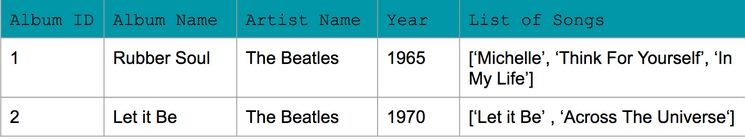
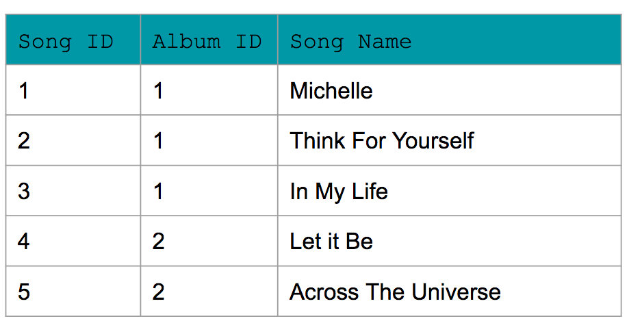
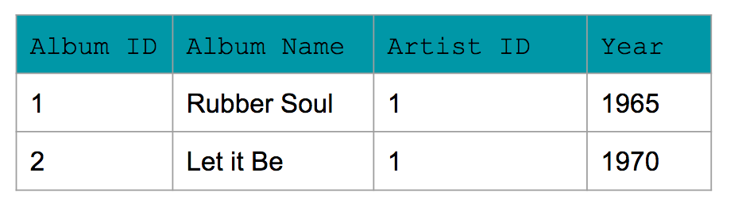
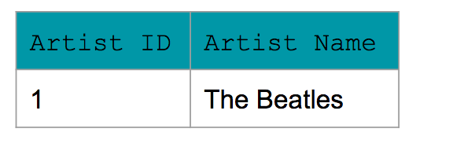
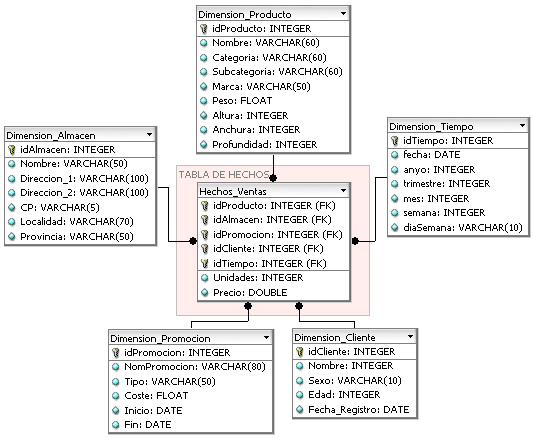
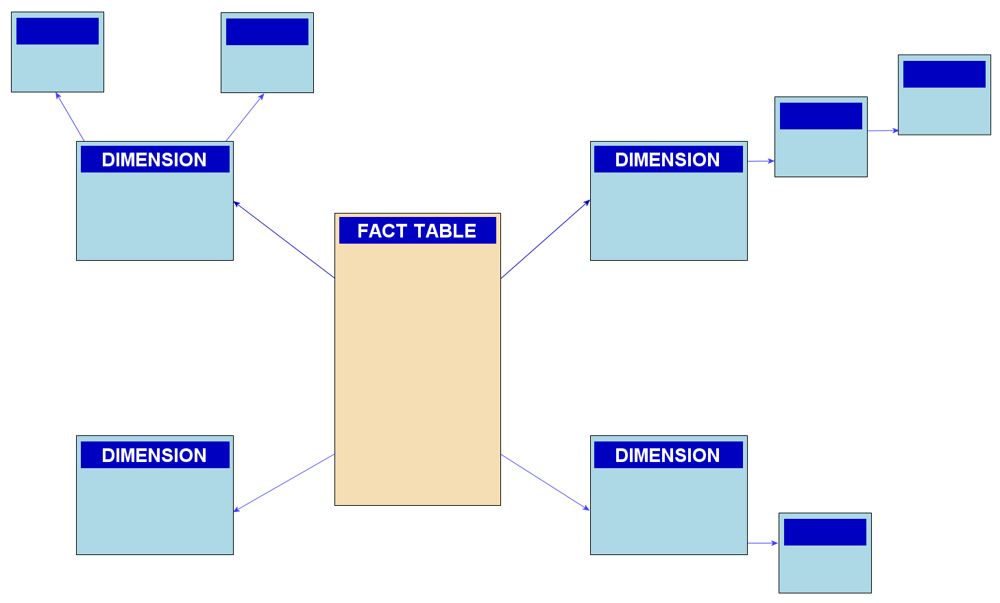

# Data Engineering Nanodegree - Part 1 - Data Modeling

## Data Engineering

### Data Modeling

#### Module 1

##### Introduction To Data Modeling

Q: What is a <b>database</b>?
<b>Answer</b>: <ul><li>A database is a structured repository or organised collection of data&nbsp;</li><li>It is stored and 
retrieved electronically for use in applications</li></ul>

<b><i>Remarks</i></b>: Data can be stored, updated, or deleted from a database.

Q: What is a <b>data base management system</b> (<b>DBMS</b>)?
<b>Answer</b>: It is the software&nbsp;that interacts with end users, applications, and the database itself to capture and analyze the data.

<b><i>Remarks</i></b>: <ol><li><a href="https://www.geeksforgeeks.org/database-management-system-introduction-set-1/">Introduction to DBMS</a></li><li><a href="https://en.wikipedia.org/wiki/Database#Database_management_system">DBMS as per Wikipedia</a></li></ol>

Q: Why can't everything be stored in a giant Excel spreadsheet?
<b>Answer</b>: There are limitations to the amount of data that can be stored in an 
Excel sheet.  So, a database helps organize the elements into tables - 
rows and columns, etc.  Also reading and writing operations on a large 
scale is not possible with an Excel sheet, so it's better to use a 
database to handle most business functions.

Q: Does data modeling happen before you create a database, or is it an iterative process?
<b>Answer</b>: <ul><li>It's definitely an iterative process. </li><li>Data engineers continually 
reorganize, restructure, and optimize data models to fit the needs of 
the organization.</li></ul>

Q: What is a data model?
<b>Answer</b>: It is an abstraction that organizes elements of data and how they will relate to each other.

<b><i>Remarks</i></b>: Check with wikipedia

Q: What is a schema?
<b>Answer</b>: The term "schema" refers to the organization of data as a blueprint of how the database is constructed (divided into database tables in the case of relational databases). 

Q: What are <b>advantages</b> of using a <b>relational database</b>?
<b>Answer</b>: <ul><li><strong>Writing SQL queries:</strong> With SQL being the most common database query language.</li><li><strong>Modeling the data not modeling queries</strong></li><li><strong>Ability to do JOINS</strong></li><li><strong>Simplicity:</strong> If you have a smaller data volume (and not big data) you can use a relational database for its simplicity.</li><li><strong>ACID Transactions</strong>: Allows you to meet a set of properties of database transactions intended to guarantee validity even in the event of errors, power failures, and thus maintain data integrity.</li></ul>

Q: Describe atomicity (ACID)
<b>Answer</b>: "The whole transaction is processed or nothing is processed."

<b><i>Example</i></b>: <ul><li>A commonly cited example of an atomic transaction is money transactions between two bank accounts.</li><li>The transaction of transferring money from one account to the other is made up of two operations.&nbsp;</li><li>First, you have to withdraw money in one account, and second you have to save the withdrawn money to the second account.&nbsp;</li><li>An atomic transaction, i.e., when either all operations occur or nothing occurs, keeps the database in a consistent state.&nbsp;</li><li>This ensures that if either of those two operations (withdrawing money from the 1st account or saving the money to the 2nd account) fail, the money is neither lost nor created.&nbsp;</li><li>Source&nbsp;<a href="https://en.wikipedia.org/wiki/Atomicity_%28database_systems%29">Wikipedia</a>&nbsp;for a detailed description of this example.</li></ul>

Q: Describe <b>consistency</b> (ACID).
<b>Answer</b>: Only transactions that abide by constraints and rules are written into  the database, otherwise the database keeps the previous state.

<b><i>Remarks</i></b>: The data should be correct across all rows and tables. Check out additional information about consistency on&nbsp;<a href="https://en.wikipedia.org/wiki/Consistency_%28database_systems%29">Wikipedia</a>.

Q: Describe&nbsp;<b>isolation</b>&nbsp;(ACID).
<b>Answer</b>: Transactions are processed independentlyand securely, order does not matter.&nbsp;

<b><i>Remarks</i></b>: <ul><li>A low level of isolation enables many users to access the data simultaneously, however this also increases the possibilities of concurrency effects (e.g., dirty reads or lost updates). </li><li>On the other hand, a high level of isolation reduces these chances of concurrency effects, but also uses more system resources and transactions blocking each other. Source:&nbsp;<a href="https://en.wikipedia.org/wiki/Isolation_%28database_systems%29">Wikipedia</a></li></ul>

Q: Describe&nbsp;<b>durability</b>&nbsp;(ACID).
<b>Answer</b>: Completed transactions are saved to  database even in cases of system failure.&nbsp;

<b><i>Example</i></b>: A commonly cited example includes tracking flight seat bookings. So once the flight booking records a confirmed seat booking, the seat remains booked even if a system failure occurs. Source:&nbsp;<a href="https://en.wikipedia.org/wiki/ACID">Wikipedia</a>.

Q: When shouldn't you use relational databases?
<b>Answer</b>: <ul>
<li><strong>Have large amounts of data:</strong> Relational Databases 
are not distributed databases and because of this they can only scale 
vertically by adding more storage in the machine itself. You are limited
 by how much you can scale and how much data you can store on one 
machine. You cannot add more machines like you can in NoSQL databases.  </li>
<li><strong>Need to be able to store different data type formats:</strong> Relational databases are not designed to handle unstructured data.</li>
<li><strong>Need high throughput -- fast reads:</strong> While ACID 
transactions bring benefits, they also slow down the process of reading 
and writing data. If you need very fast reads and writes, using a 
relational database may not suit your needs. </li>
<li><strong>Need a flexible schema:</strong> Flexible schema can allow for columns to be added that do not have to be used by every row, saving disk space.</li>
<li><strong>Need high availability:</strong> The fact that relational 
databases are not distributed (and even when they are, they have a 
coordinator/worker architecture), they have a single point of failure. 
When that database goes down, a fail-over to a backup system occurs and 
takes time.</li>
<li><strong>Need horizontal scalability:</strong> Horizontal scalability is the ability to add more machines or nodes to a system to increase performance and space for data.</li></ul>

Q: What is PostgreSQL
<b>Answer</b>: Open source object-relational database system Uses and builds on the SQL language

Q: List five common types of NoSQL Databases.
<b>Answer</b>: <ol><li>Apache Cassandra (partition row store)</li><li>MongoDB (document store)</li><li>DynamoDB (key-value store)</li><li>Apache HBase (wide column store)</li><li>Neo4J (graph database)</li></ol>

Q: Which concept in Apache Cassandra is similar to a schema in PostgreSQL?
<b>Answer</b>: The&nbsp;<b>keyspace</b>; it is<b>&nbsp;</b>a collection of tables.

Q: What are good use cases for NoSQL (and more specifically Apache Cassandra)?
<b>Answer</b>: <ol>
<li>Transaction logging (retail, health care)</li>
<li>Internet of Things (IoT)</li>
<li>Time series data</li>
<li>Any workload that is heavy on writes to the database (since Apache Cassandra is optimized for writes).&nbsp;</li></ol>

<b><i>Example</i></b>: Uber uses Apache Cassandra for their  entire backend. Netflix uses Apache Cassandra to serve all their videos to customers.

Q: When to use a NoSQL Database?
<b>Answer</b>: <ul>
<li><strong>Store different data type formats</strong>:
 NoSQL was also created to handle different data configurations: 
structured, semi-structured, and unstructured data. JSON, XML documents 
can all be handled easily with NoSQL.</li>
<li><strong>Large amounts of data</strong>: Relational databases are not
 distributed databases and because of this they can only scale 
vertically by adding more storage in the machine itself. NoSQL databases
 were created to be able to be horizontally scalable. The more 
servers/systems you add to the database the more data that can be hosted
 with high availability and low latency (fast reads and writes). </li>
<li><strong>Need horizontal scalability</strong>: Horizontal scalability is the ability to add more machines or nodes to a system to increase performance and space for data</li>
<li><strong>Need high throughput</strong>: While ACID transactions bring
 benefits they also slow down the process of reading and writing data. 
If you need very fast reads and writes using a relational database may 
not suit your needs. </li>
<li><strong>Need a flexible schema</strong>: Flexible schema can allow for columns to be added that do not have to be used by every row, saving disk space. </li>
<li><strong>Need high availability</strong>: Relational databases have a
 single point of failure. When that database goes down, a failover to a 
backup system must happen and takes time.</li><li><b>Users are distributed</b></li></ul>

Q: When NOT to use a NoSQL Database?
<b>Answer</b>: <ul><li><strong>When you have a small dataset</strong>: NoSQL databases were made for big datasets not small datasets and while it works it wasn’t created for that.</li><li><strong>When you need ACID Transactions</strong>: If you need a  consistent database with ACID transactions, then most NoSQL databases will not be able to serve this need. NoSQL databases are eventually  consistent and do not provide ACID transactions. However, there are  exceptions to it. Some non-relational databases like MongoDB can support  ACID transactions.</li><li><strong>When you need the ability to do JOINS across tables</strong>: NoSQL does not allow the ability to do JOINS. This is not allowed as this will result in full table scans.</li><li><strong>If you want to be able to do aggregations and analytics</strong></li><li><strong>If you have changing business requirements </strong>: Ad-hoc queries are possible but difficult as the data model was done to fix particular queries</li><li><strong>If your queries are not available and you need the flexibility </strong>:  You need your queries in advance. If those are not available or you  will need to be able to have flexibility on how you query your data you  might need to stick with a relational database</li></ul>

<b><i>Remarks</i></b>: <b>Caveats to NoSQL and ACID Transactions</b> <ul><li>There are some NoSQL databases that offer some form of ACID transaction.&nbsp;</li><li>As of v4.0, MongoDB added multi-document ACID transactions within a single replica set. With their later version, v4.2, they have added multi-document ACID transactions in a sharded/partitioned deployment.</li><li>Check out the documentation from MongoDB on multi-document ACID transactions</li></ul>

#### Module 2

##### Relational Data Models

Q: What are advantages of relational databases?
<b>Answer</b>: <ul><li><strong>Standardization of data model: </strong> Once your data is transformed into the rows and columns format, your data is standardized and you can query it with SQL</li><li><strong>Flexibility in adding and altering tables: </strong>Relational databases gives you flexibility to add tables, alter tables, add and remove data.</li><li><strong>Data Integrity: </strong>Data Integrity is the backbone of using a relational database.</li><li><strong>Structured Query Language (SQL): </strong> A standard language can be used to access the data with a predefined language.</li><li><strong>Simplicity :</strong> Data is systematically stored and modeled in tabular format.</li><li><strong>Intuitive Organization: </strong>The spreadsheet format is intuitive to data modeling in relational databases.</li></ul>

Q: Describe the difference between OLAP and OLTP.
<b>Answer</b>: 
<strong>Online Analytical Processing (OLAP):</strong> Databases optimized for these workloads allow for complex analytical and ad hoc queries, including aggregations. These type of databases are optimized for reads.
 
<strong>Online Transactional Processing (OLTP):</strong> Databases optimized for these workloads allow for less complex queries in large volume. The  types of  queries for these databases are read, insert, update, and delete.

<b><i>Example</i></b>: <ul><li>The key to remember the difference between OLAP and OLTP is analytics (A) vs transactions (T).&nbsp;</li><li>If you want to get the price of a shoe then you are using OLTP (this has very little or no aggregations).&nbsp;</li><li>If you want to know the total stock of shoes a particular store sold, then this requires using OLAP (since this will require aggregations).</li></ul>

<b><i>Remarks</i></b>: This&nbsp;<a href="https://stackoverflow.com/questions/21900185/what-are-oltp-and-olap-what-is-the-difference-between-them">Stackoverflow post</a>&nbsp;describes it well.

Q: What are the two most important concepts for structuring your database?
<b>Answer</b>: <ol><li>Normalization</li><li>Denormalization</li></ol>

Q: What is <b>normalization</b>?
<b>Answer</b>: The process of <b>structuring</b> a relational database in accordance with a series of <b>normal forms </b>in order to <b>reduce data redundancy</b> and <b>increase data integrity</b>.

Q: What are the <b>objectives</b> of <b>normal form</b>?
<b>Answer</b>: <ol>
<li>To free the database  from unwanted insertions, updates, &amp; deletion dependencies</li>
<li>To reduce the need for refactoring the database as new types of data are introduced</li>
<li>To make the relational model more informative to users</li>
<li>To make the database neutral to the query statistics</li></ol>

<b><i>Remarks</i></b>: See this&nbsp;<a href="https://en.wikipedia.org/wiki/Database_normalization">Wikipedia page</a>&nbsp;to learn more.

Q: What are the three steps of normalization?
<b>Answer</b>: <ol><li><b>First Normal Form (1NF)</b></li><li><b>Second Normal Form (2NF)</b></li><li><b>Third Normal Form (3NF)</b></li></ol> 

Q: How to reach First Normal Form (1NF)?
<b>Answer</b>: <ul>
<li>Atomic values: each cell contains unique and single values </li>
<li>Be able to add data without altering tables </li>
<li>Separate different relations into different tables </li>
<li>Keep relationships between tables together with foreign keys</li></ul>

Q: How to reach <b>second normal form</b> (<b>2NF</b>)?
<b>Answer</b>: <ul><li>First, reach 1NF</li><li>All columns in the table must rely on the Primary Key</li></ul>

Q: How to reach<b> third normal form</b> (<b>3NF</b>)?
<b>Answer</b>: <ul><li>Must be in 2nd Normal Form</li><li>No transitive dependencies</li><li>Remember, transitive dependencies you are trying to maintain is that to get from A-&gt; C, you want to avoid going through B.</li></ul>

Q: What is <b>denormalization</b>?
<b>Answer</b>: It is the process of trying to improve the read performance (select) of a database at the expense of losing some write performance (insert, update, delete) by adding redundant copies of data.

<b><i>Remarks</i></b>: 
<ul><li>JOINS on the database allow for outstanding flexibility but are extremely slow. </li><li>If you are dealing with heavy reads on your database, you may want to think about denormalizing your tables. </li><li>You get your data into normalized form, and then you proceed with denormalization. So, denormalization comes after normalization.</li></ul>

<strong>Citation for udacity slides:</strong> <a href="https://en.wikipedia.org/wiki/Denormalization">https://en.wikipedia.org/wiki/Denormalization</a>

Q: How does the following table look like in 3NF?  
<b>Answer</b>: 

<ol><li><em>No row contains a list of items.</em> For example, the list of songs has been replaced with each song having its own row in the Song table.</li><li><em>Transitive dependencies have been removed</em>. For example, albumID is the PRIMARY KEY for the album year in Album Table. Similarly, each of the other tables have a unique primary key that can identify the other values in the table (e.g., song id and song name within Songtable).</li></ol>
 

Song_Table 

Album_Table 

Artist_Table 

Q: What are the two most popular data mart schemas for data warehouses (because of their simplicity) ?
<b>Answer</b>: <ol><li>Star Schema</li><li>Snowflake Schema</li></ol>

Q: What is a <b>dimension</b> table?
<b>Answer</b>: A dimension is a structure that categorizes facts and measures in order to enable users to answer business questions. 

<b><i>Example</i></b>: Commonly used dimensions are people, products, place and time.

<b><i>Remarks</i></b>: Note: People and time sometimes are not modeled as dimensions.

Q: What is a <b>fact table</b>?
<b>Answer</b>: In data warehousing, a fact table consists of the measurements, metrics or facts of a business process.

<b><i>Example</i></b>: Example of a star schema; the central table is the fact table  By Jesuja - Own work, CC BY-SA 4.0, <a href="https://commons.wikimedia.org/w/index.php?curid=3886973">https://commons.wikimedia.org/w/index.php?curid=3886973</a>

<b><i>Remarks</i></b>: It is located at the center of a star schema or a snowflake schema surrounded by dimension tables.&nbsp;

Q: What is a <b>star schema</b>?
<b>Answer</b>: <ul><li>It is the simplest style of data mart schema&nbsp;</li><li>The star schema consists of one or more fact tables referencing any number of dimension tables.&nbsp;</li></ul>

<b><i>Example</i></b>:   By SqlPac at English Wikipedia, CC BY-SA 3.0, <a href="https://commons.wikimedia.org/w/index.php?curid=76901169">https://commons.wikimedia.org/w/index.php?curid=76901169</a>

<b><i>Remarks</i></b>: <ul><li>It is the approach most widely used to develop data warehouses and dimensional data marts. </li><li>The star schema is an important special case of the snowflake schema, and is more effective for handling simpler queries.</li></ul>

Q: What are benefits of star schemas?
<b>Answer</b>: 
Star schemas are <i><b>denormalized</b></i> meaning the typical rules of normalization applied to transactional 
relational databases are relaxed during star-schema design and 
implementation. The benefits of star-schema denormalization are:

<ol><li><b>Simpler queries</b> – star-schema join-logic is generally simpler 
than the join logic required to retrieve data from a highly normalized 
transactional schema.</li>
<li><b>Simplified business reporting logic </b>– when compared to highly 
normalized schemas, the star schema simplifies common business reporting
 logic, such as period-over-period and as-of reporting.</li>
<li><b>Query performance gains </b>– star schemas can provide performance 
enhancements for read-only reporting applications when compared to 
highly normalized schemas.</li>
<li><b>Fast aggregations </b>– the simpler queries against a star schema can result in improved performance for aggregation operations.</li></ol>

Q: What are <b>drawbacks </b>of <b>star schemas</b>?
<b>Answer</b>: <ol><li>The main disadvantage of the star schema is that it's <b>not as flexible </b>in terms of analytical needs as a normalized data model. Normalized models allow any kind of analytical query to be executed, so long as it follows the business logic defined in the model. Star schemas tend to be more purpose-built toward a particular view of the data, thus not really allowing more complex analytics.</li><li>Star schemas <b>don't easily support</b> <b>many-to-many relationships </b>between business entities. Typically these relationships are simplified in a star schema in order to conform to the simple dimensional model.</li><li><b>Data integrity</b> is not well-enforced due to its denormalized state. One-off inserts and updates can result in data anomalies, which normalized schemas are designed to avoid.&nbsp;</li></ol>

Q: What is the <b>snowflake schema</b>?
<b>Answer</b>: <ul><li>It is a logical arrangement of tables in a multidimensional database such that the entity relationship diagram resembles a snowflake shape.&nbsp;</li><li>The snowflake schema is represented by centralized fact tables which are connected to multiple dimensions.</li></ul>

<b><i>Example</i></b>: The snowflake schema is a variation of the star schema, featuring normalization of dimension tables.   By SqlPac - Own work, CC BY-SA 3.0, <a href="https://commons.wikimedia.org/w/index.php?curid=4285113">https://commons.wikimedia.org/w/index.php?curid=4285113</a>

<b><i>Remarks</i></b>: The snowflake schema is similar to the star schema. However, in the snowflake schema, dimensions are normalized into multiple related tables, whereas the star schema's dimensions are denormalized with each dimension represented by a single table.

Q: Describe the NOT NULL constraint (SQL)
<b>Answer</b>: The <strong>NOT NULL</strong> constraint indicates that the column cannot contain a null value.

<b><i>Example</i></b>: 
Here is the syntax for adding a NOT NULL constraint to the CREATE statement:

<pre><code>CREATE TABLE IF NOT EXISTS customer_transactions (
    customer_id int NOT NULL, 
    store_id int, 
    spent numeric
);

</code></pre>

You can add <strong>NOT NULL</strong> constraints to more than one column. Usually this occurs when you have a <strong>COMPOSITE KEY</strong>, which will be discussed further below.

Here is the syntax for it:

<pre><code>CREATE TABLE IF NOT EXISTS customer_transactions (
    customer_id int NOT NULL, 
    store_id int NOT NULL, 
    spent numeric
);
</code></pre>

Q: Describe the UNIQUE constraint (SQL)
<b>Answer</b>: The <strong>UNIQUE</strong> constraint is used to specify that the data across all the rows in one column are unique within the table. The <strong>UNIQUE</strong>
 constraint can also be used for multiple columns, so that the 
combination of the values across those columns will be unique within the
 table. In this latter case, the values within 1 column do not need to 
be unique.

<b><i>Example</i></b>: 
Let's look at an example.

<pre><code>CREATE TABLE IF NOT EXISTS customer_transactions (
    customer_id int NOT NULL UNIQUE, 
    store_id int NOT NULL UNIQUE, 
    spent numeric 
);
</code></pre>

Another way to write  a <strong>UNIQUE</strong> constraint is to add a table constraint using commas to separate the columns. 

<pre><code>CREATE TABLE IF NOT EXISTS customer_transactions (
    customer_id int NOT NULL, 
    store_id int NOT NULL, 
    spent numeric,
    UNIQUE (customer_id, store_id, spent)
);
</code></pre>

Q: Describe the PRIMARY KEY constraint (SQL)
<b>Answer</b>: <ul><li>The <strong>PRIMARY KEY</strong>  constraint is defined on a single 
column, and every table should contain a primary key. </li><li>The values in 
this column uniquely identify the rows in the table.</li></ul>

<b><i>Example</i></b>: 
Let's look at the following example:

<pre><code>CREATE TABLE IF NOT EXISTS store (
    store_id int PRIMARY KEY, 
    store_location_city text,
    store_location_state text
);
</code></pre>

Here is an example for a group of columns serving as <strong>composite key</strong>.

<pre><code>CREATE TABLE IF NOT EXISTS customer_transactions (
    customer_id int, 
    store_id int, 
    spent numeric,
    PRIMARY KEY (customer_id, store_id)
);
</code></pre>

<b><i>Remarks</i></b>: <ul><li>If a group of columns are defined as a primary key, they are called a&nbsp;<strong>composite key</strong>. That means the combination of values in these columns will uniquely identify the rows in the table.&nbsp;</li><li>By default, the&nbsp;<strong>PRIMARY KEY</strong>&nbsp;constraint has the unique and not null constraint built into it.</li></ul>

Q: What is an <b>upsert</b> in RDBMS language?
<b>Answer</b>: <ul><li>In RDBMS language, the term <em>upsert</em> refers to the idea of 
inserting a new row in an existing table, or updating the row if it 
already exists in the table. </li><li>The action of updating or inserting has 
been described as "upsert".</li></ul>

<b><i>Example</i></b>: 
Now let's assume that the customer moved and we need to update the 
customer's address. However we do not want to add a new customer id. In 
other words, if there is any conflict on the <code>customer_id</code>, we do not want that to change.

This would be a good candidate for using the <strong>ON CONFLICT DO NOTHING</strong> clause.

<pre><code>INSERT INTO customer_address (customer_id, customer_street, customer_city, customer_state)
VALUES
 (
 432, '923 Knox Street', 'Albany', 'NY'
 ) 
ON CONFLICT (customer_id) 
DO NOTHING;
</code></pre>

Now, let's imagine we want to add more details in the existing 
address for an existing customer. This would be a good candidate for 
using the <strong>ON CONFLICT DO UPDATE</strong> clause.

<pre><code>INSERT INTO customer_address (customer_id, customer_street)
VALUES
    (
    432, '923 Knox Street, Suite 1' 
) 
ON CONFLICT (customer_id) 
DO UPDATE
    SET customer_street  = EXCLUDED.customer_street;
</code></pre>

<b><i>Remarks</i></b>: The way this is handled in PostgreSQL is by using the <code>INSERT</code> statement in combination with the <code>ON CONFLICT</code> clause.

Q: How can you perform an upsert in PostgreSQL?
<b>Answer</b>: By using the&nbsp;<code>INSERT</code>&nbsp;statement in combination with the&nbsp;<code>ON CONFLICT</code>&nbsp;clause.

Q: What is the <b>extract</b>, <b>transform</b>, <b>load</b> (<b>ETL</b>) process?
<b>Answer</b>: It is a general procedure of copying data from one or more sources into a destination system which represents the data differently from the source(s) or in a different context than the source(s).&nbsp;

<b><i>Remarks</i></b>: The ETL process became a popular concept in the 1970s and is often used in data warehousing.

#### Module 3

##### Nosql Data Models

Q: What is <b>eventual consistency</b>?
<b>Answer</b>: <ul><li>Over time (if no new changes are made)  each copy of the data will be 
the same, but if there are new changes, the data may be different in 
different locations. </li><li>The data may be inconsistent for only milliseconds.
 There are workarounds in place to prevent getting stale data.</li></ul>

<b><i>Remarks</i></b>: See also:&nbsp;<a href="https://en.wikipedia.org/wiki/Eventual_consistency">https://en.wikipedia.org/wiki/Eventual_consistency</a>

Q: What does the&nbsp;<b>CAP theorem </b>state?
<b>Answer</b>: It states that it is impossible for a distributed data store to simultaneously provide more than two out of the following three guarantees: <ol><li><b>Consistency</b></li><li><b>Availability</b></li><li><b>Partition tolerance</b></li></ol>

Q: What do <b>consistency</b>, <b>availability</b> and <b>partition tolerance</b> mean in the <b>CAP theorem</b>?
<b>Answer</b>: <ol><li><b>Consistency</b>: Every read receives the most recent write or an error.</li><li><b>Availability</b>: Every request receives a (non-error) response, without the guarantee that it contains the most recent write.</li><li><b>Partition tolerance</b>: The system continues to operate despite an arbitrary number of messages being dropped (or delayed) by the network between nodes.</li></ol>

Q: How is CAP Consistency different from ACID Consistency?
<b>Answer</b>: <ul><li>ACID consistency is all about database rules. If a schema declares that a value must be unique, then a consistent system will enforce uniqueness of that value across all operations. If a foreign key implies deleting one row will delete related rows, then a consistent system will ensure the state can’t contain related rows once the base row is deleted.</li><li>CAP consistency promises that every replica of the same logical value, spread across nodes in a distributed system, has the same exact value at all times. Note that this is a logical guarantee, rather than a physical one. Due to the speed of light, it may take some non-zero time to replicate values across a cluster. The cluster can still present a logical view by preventing clients from viewing different values at different nodes.</li></ul>

<b><i>Remarks</i></b>: Source:&nbsp;<a href="https://www.voltdb.com/blog/2015/10/disambiguating-acid-cap/">https://www.voltdb.com/blog/2015/10/disambiguating-acid-cap/</a>

Q: List a few important rules for data modeling in Apache Cassandra.
<b>Answer</b>: <ul><li>Denormalization must be done for fast reads</li><li>ALWAYS think Queries first</li><li>One table per query is a great strategy</li><li>Apache Cassandra does not allow for JOINs between tables</li></ul>

Q: Why do we need to use a WHERE statement in Apache Cassandra?
<b>Answer</b>: <ul><li>The WHERE statement is allowing us to do the fast reads.&nbsp;</li><li>With Apache Cassandra, we are talking about big data -- think terabytes of data -- so we are making it fast for read purposes.&nbsp;</li><li>Data is spread across all the nodes. By using the WHERE statement, we know which node to go to, from which node to get that data and serve it back.&nbsp;</li></ul>

<b><i>Example</i></b>: <ul><li>For example, imagine we have 10 years of data on 10 nodes or servers. So 1 year's data is on a separate node.&nbsp;</li><li>By using the WHERE year = 1 statement we know which node to visit fast to pull the data from.</li></ul>

Q: Can you do <code>SELECT * FROM myTable</code> in Apache Cassandra?
<b>Answer</b>: It is highly discouraged because performance will be slow (or it may just fail) but it is possible with the&nbsp;"ALLOW FILTERING" configuration.

Q: What is the purpose of the <b>PRIMARY KEY</b> in Apache Cassandra?
<b>Answer</b>: It it used to uniquely identify each row and to specify how the data is distributed across the nodes (or servers) in our system.

Q: What is the difference between a <b>simple PRIMARY KEY</b> and a <b>composite PRIMARY KEY</b>?
<b>Answer</b>: <ol><li>A Simple PRIMARY KEY is just one column that is also the PARTITION KEY.&nbsp;</li><li>A Composite PRIMARY KEY is made up of more than one column and will assist in creating a unique value in your retrieval queries.</li></ol>

Q: What is the&nbsp;<b>PRIMARY KEY</b> made up in Cassandra?
<b>Answer</b>: It is made up of either just the <b>PARTITION KEY</b> or it may additionaly include one or more <b>CLUSTERING COLUMNS</b>.

## Acronyms

DBMS: Database Management System 

DDL: Data Definition Language 

RDBMS: Relational Database Management System 

SQL: Structured Query Language 

ACID: Atomicity, Consistency, Isolation, Durability

CQL: Cassandra Query Language

ERD: Entity Relationship Diagram 

OLAP: Online Analytical Processing 

OLTP: Online Transaction Processing

ETL: Extract, Transform, Load 

*[DBMS]: Database Management System
*[DDL]: Data Definition Language
*[RDBMS]: Relational Database Management System
*[SQL]: Structured Query Language
*[ACID]: Atomicity, Consistency, Isolation, Durability
*[CQL]: Cassandra Query Language
*[ERD]: Entity Relationship Diagram
*[OLAP]: Online Analytical Processing
*[OLTP]: Online Transaction Processing
*[ETL]: Extract, Transform, Load
