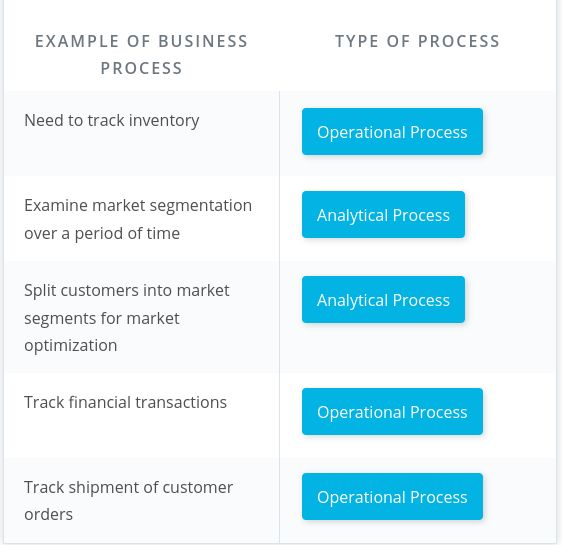
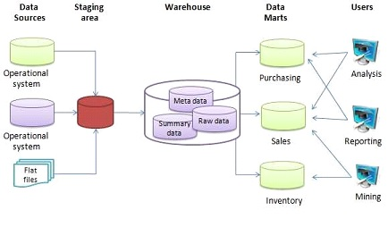
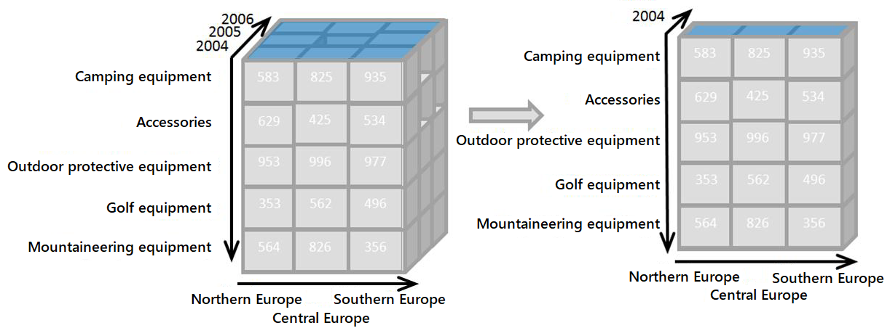
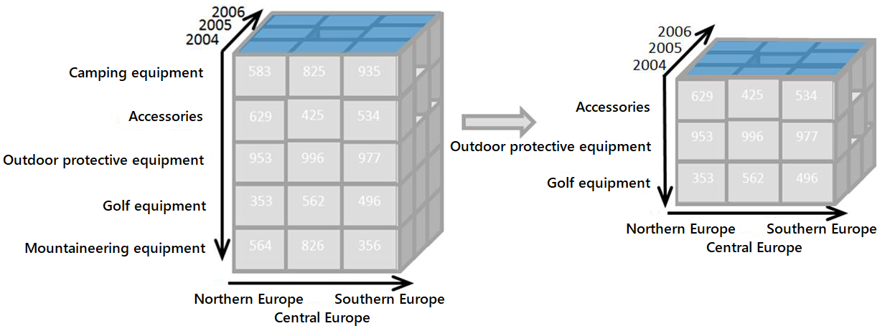

# Data Engineering Nanodegree - Part 2 - Cloud Data Warehouses

## Data Engineering

### Cloud Data Warehouses

#### Module 1

##### Introduction To Data Warehouses

Q: Give some examples for <b>operational</b> and for <b>analytical business processes</b>.
<b>Answer</b>: <b>Operational processes</b> (<i>make it work</i>) <ul><li>Find goods &amp; make orders (for customers)</li><li>Stock and find goods (for inventory staff)</li><li>Pick up &amp; deliver goods (for delivery staff)</li></ul><b>Analytical processes</b> (<i>what is going on?</i>) <ul><li>Assess the performance of sales staff (for HR)</li><li>See the effect of different sales channels (for marketing)</li><li>Monitor sales growth (for marketing)</li></ul>

<b><i>Example</i></b>: 

Q: What is a <b>data warehouse</b>?
<b>Answer</b>: <ul><li>DWs are central repositories of integrated data from one or more disparate sources.&nbsp;</li><li>They store current and historical data in one single place that are used for creating analytical reports for workers throughout the enterprise. </li></ul>

<b><i>Example</i></b>: The basic architecture of a data warehouse:   By Soha jamil - Own work, CC BY-SA 4.0, <a href="https://commons.wikimedia.org/w/index.php?curid=46448452">https://commons.wikimedia.org/w/index.php?curid=46448452</a>

<b><i>Remarks</i></b>: Alternative definitions: <ul><li>"A copy of transaction data specifically structured for query and analysis"&nbsp; (Kimball)</li><li>"A <b>subject-oriented</b>,<b> integrated</b>, <b>nonvolatile</b>, and <b>time-variant</b> collection of data in support of management's decisions" (Inmon)</li><li>"A system that <b>retrieves</b> and <b>consolidates </b>data<b> periodically </b>from the source systems into a <b>dimensional </b>or <b>normalized</b> data store. It usually <b>keeps years of history </b>and is <b>queried for business intelligence</b> or other <b>analytical activities</b>. It is typicall <b>updated in batches</b>, not every time a transaction happens in the source system." (Rainardi)</li></ul>

Q: What are drawbacks of using the <b>same database </b>for both <b>OLAP</b> and <b>OLTP</b>?
<b>Answer</b>: <ul><li>The database schema will be hard to understand for business analysts</li><li>The analytical queries will be slow as we will have to perform lots of table joins</li></ul>

<b><i>Remarks</i></b>: However, for small databases, it might be ok.

Q: Which constraints need to be satisfied for an entry to be a fact?
<b>Answer</b>: It must be&nbsp;<b>numeric</b>, and&nbsp;<b>additive</b>.

Q: Which schema is easier to use for a business user: <b>3NF schema</b> or <b>star schema</b>?
<b>Answer</b>: The <b>star schema</b>.

Q: List four DWH architectures.
<b>Answer</b>: <ol><li>Kimball's bus architecture</li><li>Independent Data Marts</li><li>Inmon's Corporate Information Factory (CIF)</li><li>Hybrid Bus &amp; CIF</li></ol>

Q: What is an <b>OLAP cube</b>?
<b>Answer</b>: It is an aggregation of a fact metric on a number of dimensions.&nbsp;

<b><i>Example</i></b>: Schematisches Beispiel eines Dimensionswürfels mit drei Dimensionen (Data Cube)  Von Mantronic - selbst erstellt, CC BY-SA 3.0, <a href="https://de.wikipedia.org/w/index.php?curid=2852018">https://de.wikipedia.org/w/index.php?curid=2852018</a>

Q: Describe the two approaches of serving OLAP cubes.
<b>Answer</b>: <ol><li><b>MOLAP</b>:<b> Pre-aggregrates</b> the OLAP cubes and saves them on a special purpose non-relational database.</li><li><b>ROLAP</b>: Computes the OLAP cubes <b>on the fly</b> from the existing relational databases where the dimensional model resides.&nbsp;</li></ol>

Q: What are the main characteristics of the <b>Kimball Bus architecture</b>?
<b>Answer</b>: <ul><li>Data is kept in a common dimension data model shared across different departments (It does not allow for individual department specific data modeling requirements).</li><li>Data is not kept at the aggregate level, but rather at the atomic level</li><li>It is organized by business processes, and used by different departments</li></ul>

Q: How do <b>independent data marts</b> differ from the Kimball bus structure?
<b>Answer</b>: <ul><li>Every department has independent ETL processes &amp; dimensional models</li><li>These separate &amp; smaller dimensional models are called <b>data marts</b>.</li><li>There are different fact tables for the same events (<b>no conformed dimensions</b>)</li></ul>

Q: What are the main characteristics of Inmon's<b> corporate Information factory</b> (<b>CIF</b>)?
<b>Answer</b>: <ul><li>It contains an enterprise data warehouse that provides a normalized data architecture before individual departments build on it</li><li>The data marts use a source 3NF model and add denormalization based on department needs</li></ul>

Q: Describe <b>slicing </b>(OLAP cube operation).
<b>Answer</b>: It's reducing \(N\) dimensions to \(N-1\) dimensions by restricting one dimension to a single value.

<b><i>Example</i></b>:  By Original: InfopedianDerivative work: Jay - OLAP slicing.png, CC BY-SA 4.0, <a href="https://commons.wikimedia.org/w/index.php?curid=105680876">https://commons.wikimedia.org/w/index.php?curid=105680876</a>

Q: Describe <b>dicing&nbsp;</b>(OLAP cube operation).
<b>Answer</b>: It's computing a sub-cube by picking specific values of multiple dimensions.

<b><i>Example</i></b>:  By Original: InfopedianDerivative work: Jay - OLAP dicing.png, CC BY-SA 4.0, <a href="https://commons.wikimedia.org/w/index.php?curid=105725772">https://commons.wikimedia.org/w/index.php?curid=105725772</a>

Q: Describe <b>rolling-up&nbsp;</b>(OLAP cube operation).
<b>Answer</b>: It's aggregating or combining values and reducing the number of rows or columns.

Q: Describe <b>drilling-down&nbsp;</b>(OLAP cube operation).
<b>Answer</b>: It's decomposing values and increasing the number of rows or columns.

<b><i>Example</i></b>: The picture shows a drill-down operation: The analyst moves from the  summary category "Outdoor-Schutzausrüstung" to see the sales figures for  the individual products.  Von Infopedian - own illustration, CC BY-SA 4.0, <a href="https://commons.wikimedia.org/w/index.php?curid=14789910">https://commons.wikimedia.org/w/index.php?curid=14789910</a>

Q: Describe the <b>GROUP BY CUBE</b> clause.
<b>Answer</b>: <ul><li>PostgreSQL <code>CUBE</code> is a subclause of the GROUP BY&nbsp;clause. </li><li>The <code>CUBE</code> allows you to generate multiple grouping sets.</li></ul>

<b><i>Example</i></b>: <pre><code>SELECT
    c1,
    c2,
    c3,
    aggregate (c4)
FROM
    table_name
GROUP BY
    CUBE (c1, c2, c3); </code></pre>
would generate all possible grouping sets based on the dimension columns specified in CUBE. It's a short way to define multiple grouping sets: <pre><code>CUBE(c1,c2,c3) 

GROUPING SETS (
    (c1,c2,c3), 
    (c1,c2),
    (c1,c3),
    (c2,c3),
    (c1),
    (c2),
    (c3), 
    ()
 ) </code></pre>

#### Module 2

##### Introduction To Cloud Computing And Aws

Q: What is <b>cloud computing</b>?
<b>Answer</b>: It is the practice of using a <b>network of remote servers</b> hosted on the internet to <b>store</b>, <b>manage</b>, and <b>process data</b>, rather than a local server or a personal computer.

Q: What are <b>advantages</b> of <b>cloud computing</b>?
<b>Answer</b>: <ol><li>Eliminate need to invest in <b>costly hardware</b> upfront</li><li>It's significantly <b>faster provisioning the resources</b> you need through 
the cloud versus the time it would take to gather and build up the 
hardware you'd need to provide the same support</li><li>You can provide <b>efficient access</b> to your applications around the world by spreading your deployments to multiple regions.</li></ol>

Q: In which three ways can AWS services be accessed?
<b>Answer</b>: <ol><li><b>AWS Management Console</b>, which is the web user 
interface.&nbsp;</li><li>The <b>AWS CLI</b> is a useful way to control and automate your 
services with code</li><li><b>SDK</b>s allow you to easily integrate services with
 your applications through APIs built around specific languages and 
platforms.</li></ol>

#### Module 3

##### Implementing Data Warehouses On Aws

Q: Give the main technological characteristics of Redshift.
<b>Answer</b>: <ul><li>It is column-oriented</li><li>It is cloud-managed</li><li>It provides massively parallel processing (MPP)</li></ul>

Q: What is the number of nodes in a Redshift cluster equal to?
<b>Answer</b>: The number of AWS EC2 instances used in the cluster.

Q: What is each slice in a Redshift cluster?
<b>Answer</b>: At least 1 CPU with dedicated storage and memory for the slice.

Q: If we have a Redshift cluster with 4 nodes, each containing 8 slices, 
i.e. the cluster collectively offers 32 slices. What is the maximum 
number of partitions per table?
<b>Answer</b>: 32

<b><i>Remarks</i></b>: The total number of slices in a cluster is our unit of parallelism and it is equal to the sum of all slices on the cluster.

Q: In the ETL implementation on AWS, what is the purpose of the EC2 instance (ETL server)?
<b>Answer</b>: <ul><li>It just acts as a client to RDS and Redshift to issue COPY commands</li><li>Because we store all the data in S3 buckets, we do not need storage on the EC2 machine</li></ul>

Q: What are advantages of using S3 for ETL storage? (Compared to storing the data in our own EC2 instance)
<b>Answer</b>: <ul><li>S3 is AWS-managed, we don't need to worry about storage reliability.</li><li>By using S3, we only pay for the storage we use,</li><li>By using S3, we don't need to worry about not having enough storage.</li></ul>

Q: Why do we might need to copy data already stored in S3 to another S3 staging bucket during the ETL process?
<b>Answer</b>: Because we will most likely transform the data before inserting it into the DWH.

Q: Which method is faster for ingesting data in a sql database? Using the INSERT command in a loop or using bulk insertion with the COPY command?
<b>Answer</b>: Bulk insertion with the COPY command.

Q: Why should we split a table into multiple files before ingesting them into Redshift?
<b>Answer</b>: Because this way, we can execute multiple simultaneous COPY commands.

<b><i>Remarks</i></b>: Each Redshift slice will act as a separate worker and will ingest the split of a file in parallel, so the process will complete 
much faster.

Q: 

If you have multiple files that belong to the same table names as follows:  

<ul>
<li>s3://mySource/day1-sales.csv.gz</li>
<li>s3://mySource/day2-sales.csv.gz ...</li>
</ul>

Which method are you going to use to ingest the files from S3 into Redshift?

<b>Answer</b>: <ul><li>You would need to create a manifest file.</li></ul>

<b><i>Remarks</i></b>: 

Since the files have a common suffix and not a common prefix, we 
actually need to create a manifest specifying the list of files. If they
 were named:   

<ul>
<li>s3://mySource/sales-day1.csv.gz  </li>
<li>s3://mySource/sales-day2.csv.gz   </li>
</ul>

we could have relied on the existence of a common prefix.

Q: What are advantages of infrastructure-as-code over creating infrastructure by clicking-around?
<b>Answer</b>: <ol><li><b>Sharing</b>: one can share all the steps with others easily</li><li><b>Reproducibility</b>: one can be sure that no steps are forgotten</li><li><b>Multiple deployments</b>: one can create a test environment identical to the production environment.</li><li><b>Maintainability</b>: if a change is needed, one can keep track of the changes by comparing code.</li></ol>

<b><i>Remarks</i></b>: Sharing, Reproducibility, Multiple Deployments &amp; Maintainability are all advantages of IaC.

Q: What is Boto3?
<b>Answer</b>: <ul><li>Boto3 is a Python SDK for programmatically accessing AWS. </li><li>It enables 
developers to create, configure, and manage AWS services.</li></ul>

<b><i>Remarks</i></b>: You can find the documentation for Boto3&nbsp;<a href="https://boto3.amazonaws.com/v1/documentation/api/latest/index.html">here</a>.

Q: Which two strategies exist to optimize table design (slicing)?
<b>Answer</b>: <ol><li>Distribution style</li><li>Sorting Key</li></ol>

Q: What is a drawback of joining 2 tables distributed using an EVEN strategy?
<b>Answer</b>: It is slow because records need to be shuffled to put together the join result.

<b><i>Example</i></b>: For example, a given key (say key=2532) of table 1 will not be on the same slice as 
the corresponding record in table 2, so the record will be copied (shuffled)
 between slices on different nodes, which results in slow performance.

Q: What does the EVEN key distribution style mean?
<b>Answer</b>: It means that a table is distributed across slices such that all slices have approximately the equal amount of records from the partitioned table.

Q: What does the ALL distribution style do to a table?
<b>Answer</b>: It replicates a table on all slices.

<b><i>Remarks</i></b>: This is especially useful for small tables that are used often.

Q: What's another common name for the ALL distribution style?
<b>Answer</b>: "<b>Broadcasting</b>" is a common term used to the implementation of the ALL distribution style.

Q: How does the AUTO distribution style work?
<b>Answer</b>: <ul><li>It leaves the distribution decision to Redshift</li><li>"Small enough" tables are distributed with an ALL strategy</li><li>Large tables are distributed with an EVEN strategy</li></ul>

Q: How does the key distribution style distribute the tables?
<b>Answer</b>: It places rows with similar values on the same slice.

Q: What are the four types of distribution styles in Redshift?
<b>Answer</b>: <ol><li>Even</li><li>All</li><li>Auto</li><li>Key</li></ol>

## Acronyms

DWH: Data Warehouse 

CIF: Corporate Information Factory 

ROLAP: Relational OLAP

MOLAP: Multidimensional OLAP

SDK: Software Development Kit 

*[DWH]: Data Warehouse
*[CIF]: Corporate Information Factory
*[ROLAP]: Relational OLAP
*[MOLAP]: Multidimensional OLAP
*[SDK]: Software Development Kit
