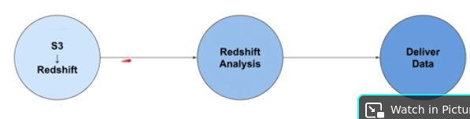
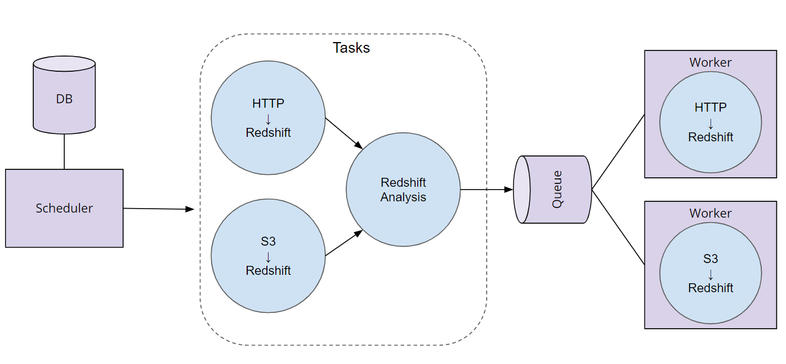
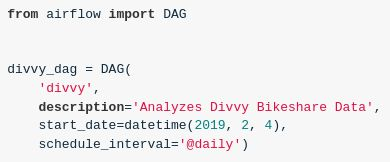
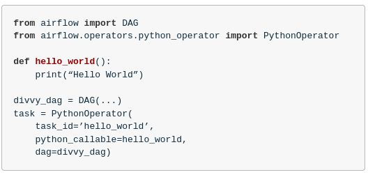
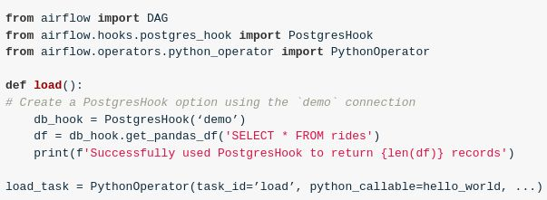
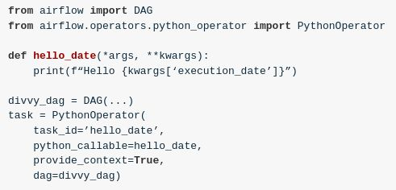

# Data Engineering Nanodegree - Part 4 - Data Pipelines With Airflow


## Data Engineering


### Data Pipelines With Airflow


#### Module 1


##### Data Pipelines

<p><details><summary>Q: What is a <b>data pipeline</b>?</summary><b>Answer</b>: A series of steps in which data is processed.

<b><i>Example</i></b>: <ul><li>Automated marketing emails</li><li>Real-time pricing in rideshare apps</li><li>Targeted advertising based on browsing history</li></ul>

<b><i>Remarks</i></b>: It's typically using either ETL or ELT.

</details></p>

<p><details><summary>Q: Given an example of a data pipeline to accomplish the following: <i>a bikeshare company wants to efficiently improve availability of bikes.</i></summary><b>Answer</b>: <ol><li>Load application event data from a source such as S3 or Kafka</li><li>Load the data into an analytic warehouse such as RedShift.</li><li>Perform data transformations that identify high-traffic bike docks so the business can determine where to build additional locations.</li></ol>

</details></p>

<p><details><summary>Q: Describe the difference between ETL and ELT.</summary><b>Answer</b>: <div><ul><li>ETL is normally a continuous, ongoing process with a well-defined 
workflow. ETL first extracts data from homogeneous or heterogeneous data
 sources. Then, data is cleansed, enriched, transformed, and stored 
either back in the lake or in a data warehouse.</li><li>ELT (Extract, Load, Transform) is a variant of ETL wherein the 
extracted data is first loaded into the target system. Transformations 
are performed after the data is loaded into the data warehouse.</li></ul></div>

<b><i>Remarks</i></b>: <em>ELT typically works well when the target system is powerful enough to handle transformations. Analytical databases like Amazon Redshift and Google BigQ.</em>

</details></p>

<p><details><summary>Q: What is <b>S3</b>?</summary><b>Answer</b>: <ul><li>Amazon S3 has a simple web services interface that you can use to 
store and retrieve any amount of data, at any time, from anywhere on the
 web.&nbsp;</li><li>It gives any developer access to the same highly scalable, 
reliable, fast, inexpensive data storage infrastructure that Amazon uses
 to run its own global network of web sites.</li></ul>

<b><i>Remarks</i></b>: <div><ul><li><em>Source:</em>&nbsp;<a href="https://docs.aws.amazon.com/AmazonS3/latest/dev/Welcome.html">Amazon Web Services Documentation</a>.</li><li>If you want to learn more, start&nbsp;<a href="https://docs.aws.amazon.com/AmazonS3/latest/dev/Welcome.html">here</a>.</li></ul></div>

</details></p>

<p><details><summary>Q: What is <b>Kafka</b>?</summary><b>Answer</b>: <ul><li>Apache Kafka is an <strong>open-source stream-processing software platform&nbsp;</strong>developed by Linkedin and donated to the Apache Software Foundation, written in Scala and Java.&nbsp;</li><li>The project aims to provide a unified, high-throughput, low-latency platform for handling real-time data feeds.</li></ul>

<b><i>Remarks</i></b>: <ul><li>Its storage layer is essentially a massively scalable pub/sub message queue designed as a distributed transaction log, making it highly valuable for enterprise infrastructures to process streaming data."</li><li><div><em>Source:</em>&nbsp;<em>Wikipedia</em><br></div></li><li><div>If you want to learn more, start&nbsp;<a href="https://kafka.apache.org/intro">here</a>.</div></li></ul>

</details></p>

<p><details><summary>Q: What is <b>RedShift</b>?</summary><b>Answer</b>: Amazon Redshift is a fully managed, petabyte-scale data warehouse 
service in the cloud.

<b><i>Remarks</i></b>: <ul><li>The first step to create a data warehouse is to launch a set of nodes, called an Amazon Redshift cluster.&nbsp;</li><li>After you provision your cluster, you can upload your data set and then perform data analysis queries.</li><li>Regardless of the size of the data set, Amazon Redshift offers fast query performance using the same SQL-based tools and business intelligence applications that you use today.</li><li>If you want to learn more, start&nbsp;<a href="https://docs.aws.amazon.com/redshift/latest/mgmt/welcome.html">here</a>.</li></ul>

</details></p>

<p><details><summary>Q: What is <b>data validation</b>?</summary><b>Answer</b>: It is the process of ensuring that data is present, correct
 &amp; meaningful.

<b><i>Remarks</i></b>: Ensuring the quality of your data through automated validation checks is a critical step in building data pipelines at any organization.

</details></p>

<p><details><summary>Q: List some data validation steps for the bikeshare example.</summary><b>Answer</b>: After loading from S3 to Redshift:<br><ul><li>Validate the number of rows in Redshift match the number of records in S3</li></ul>Once location business analysis is complete:<br><ul><li>Validate that all locations have a daily visit average greater than 0</li><li>Validate that the number of locations in our output table match the number of tables in the input table.</li></ul>

</details></p>

<p><details><summary>Q: Are there real world cases where a data pipeline is not a DAG?</summary><b>Answer</b>: <ul><li>It is possible to model a data pipeline that is not a DAG, meaning that 
it contains a cycle within the process.&nbsp;</li><li>However, the vast majority of 
use cases for data pipelines can be described as a directed acyclic 
graph (DAG).&nbsp;</li><li>This makes the code more understandable and maintainable.</li></ul>

</details></p>

<p><details><summary>Q: Can we have two different pipelines for the same data and can we merge them back together?</summary><b>Answer</b>: Yes. It's not uncommon for a data pipeline to take the same dataset, <br>perform two different processes to analyze it, then merge the <br>results of those two processes back together.

</details></p>

<p><details><summary>Q: How could the bikeshare example be modeled as a DAG?</summary><b>Answer</b>: 

</details></p>

<p><details><summary>Q: What are the<b> five components</b> of <b>airflow</b>?</summary><b>Answer</b>: <ol><li>The <b>s</b><strong>cheduler</strong> orchestrates the execution of jobs on a 
trigger or schedule. It chooses how to prioritize the running
 and execution of tasks within the system.</li>
<li>The<strong>&nbsp;work queue</strong> is used by the scheduler in most Airflow installations to deliver tasks that need to be run to the workers. </li>
<li><strong>Worker</strong> processes execute the operations defined in each DAG. In most Airflow installations, workers pull from the work queue
 when it is ready to process a task. When the worker completes the 
execution of the task, it will attempt to process more work from the work queue until there is no further work remaining.</li>
<li><strong>Database</strong> saves credentials, connections, history, and configuration. The database, often referred to as the <em>metadata database</em>, also stores the state of all tasks in the system.&nbsp;</li>
<li>The<strong> web Interface</strong> provides a control dashboard for 
users and maintainers. Throughout this course you will see how the web 
interface allows users to perform tasks such as stopping and starting 
DAGs, retrying failed tasks, configuring credentials,</li></ol>

<b><i>Example</i></b>: 

</details></p>

<p><details><summary>Q: Describe the order of operations for an <b>Airflow </b>DAG.</summary><b>Answer</b>: <ul>
<li>The <b>scheduler </b>starts DAGs based on time or external triggers.</li>
<li>Once a DAG is started, the scheduler looks at the steps within the 
DAG and determines which steps can run by looking at their dependencies.</li>
<li>The scheduler places runnable steps in the queue.</li>
<li>Workers pick up those tasks and run them. </li>
<li>Once the worker has finished running the step, the final status of 
the task is recorded and additional tasks are placed by the scheduler 
until all tasks are complete.</li>
<li>Once all tasks have been completed, the DAG is complete.&nbsp;</li></ul>

<b><i>Example</i></b>: 

</details></p>

<p><details><summary>Q: What does the airflow<b> scheduler </b>do?</summary><b>Answer</b>: It starts DAGs based on triggers or schedules and moves them towards completion.

</details></p>

<p><details><summary>Q: What do the Airflow workers do?</summary><b>Answer</b>: They run and record the outcome of individual pipeline tasks.

</details></p>

<p><details><summary>Q: How to create a DAG in Airflow?</summary><b>Answer</b>: Creating a DAG is easy.&nbsp;<br><ol><li>Give it a <b>name</b>,</li><li>a <b>description</b>,</li><li>a <b>start date</b>, and an</li><li><b>interval</b>.</li></ol>

<b><i>Example</i></b>: 

</details></p>

<p><details><summary>Q: What are <b>operators</b> in Airflow?</summary><b>Answer</b>: They define the atomic steps of work that make up a DAG.

<b><i>Example</i></b>: 

<b><i>Remarks</i></b>: Instantiated operators are referred to as <strong>Tasks</strong>.

</details></p>

<p><details><summary>Q: What does Airflow do when the start date is in the past?</summary><b>Answer</b>: Airflow will run your DAG as many times as there are schedule intervals between that start date and the current date.

</details></p>

<p><details><summary>Q: What are the <b>nodes</b> and <b>edges</b> in an Airflow DAG?</summary><b>Answer</b>: <ul>
<li>Nodes = Tasks</li>
<li>Edges = Ordering and dependencies between tasks</li></ul>

<b><i>Remarks</i></b>: <div>Task dependencies can be described programmatically in Airflow using <code>&gt;&gt;</code> and <code>&lt;&lt;</code></div>
<ul>
<li>a <code>&gt;&gt;</code> b means a comes before b</li>
<li>a <code>&lt;&lt;</code> b means a comes after b</li></ul>

</details></p>

<p><details><summary>Q: How to programmatically describe task dependencies in Airflow?</summary><b>Answer</b>: <div>Task dependencies can be described programmatically in Airflow using <code>&gt;&gt;</code> and <code>&lt;&lt;</code></div>
<ul>
<li>a <code>&gt;&gt;</code> b means a comes before b</li>
<li>a <code>&lt;&lt;</code> b means a comes after b</li></ul>

<b><i>Example</i></b>: ```<br>hello_world_task = PythonOperator(task_id=’hello_world’, ...)<br>goodbye_world_task = PythonOperator(task_id=’goodbye_world’, ...)<br>```<br><br>Use `&gt;&gt;` to denote that `goodbye_world_task` depends on `hello_world_task`<br>```hello_world_task &gt;&gt; goodbye_world_task```

</details></p>

<p><details><summary>Q: What are Airflow Hooks?</summary><b>Answer</b>: Hooks provide a reusable interface to external systems and databases.

<b><i>Example</i></b>: 

<b><i>Remarks</i></b>: With hooks, you don’t have to worry about how and where to store these connection strings and secrets in your code.

</details></p>

<p><details><summary>Q: What's the purpose of <b>runtime variables</b> in Airflow?</summary><b>Answer</b>: They allow users to “fill in the blank” with important runtime variables for tasks.

<b><i>Example</i></b>: 

<b><i>Remarks</i></b>: <a href="https://airflow.apache.org/docs/apache-airflow/stable/macros-ref.html">Here</a> is the Apache Airflow documentation on <strong>context variables</strong> that can be included as kwargs.

</details></p>

<p><details><summary>Q: What is a Task in Airflow?</summary><b>Answer</b>: An instantiated step in a pipeline fully parameterized for execution.

</details></p>


#### Module 2


##### Data Quality

<p><details><summary>Q: What is <b>data lineage</b>?</summary><b>Answer</b>: The data lineage of a dataset describes the discrete steps involved in the creation, movement, and calculation of that dataset.

</details></p>

<p><details><summary>Q: Why is <b>data lineage</b> important?</summary><b>Answer</b>: <ol>
<li><strong>Instilling Confidence:</strong> Being able to describe the 
data lineage of a particular dataset or analysis will build confidence 
in data consumers (engineers, analysts, data scientists, etc.) that our 
data pipeline is creating meaningful results using the correct datasets.</li>
<li><strong>Defining Metrics:</strong> Another major benefit of 
surfacing data lineage is that it allows everyone in the organization to
 agree on the definition of how a particular metric is calculated.</li>
<li><strong>Debugging:</strong> Data lineage helps data engineers track 
down the root of errors when they occur. If each step of the data 
movement and transformation process is well described, it's easy to find
 problems when they occur.</li></ol>

<b><i>Remarks</i></b>: <ul><li>In general, data lineage has important implications for a business.&nbsp;</li><li>Each
 department or business unit's success is tied to data and to the flow 
of data between departments.&nbsp;</li><li>For e.g., sales departments rely on data to
 make sales forecasts, while at the same time the finance department 
would need to track sales and revenue.&nbsp;</li><li>Each of these departments and 
roles depend on data, and knowing where to find the data.&nbsp;</li><li>Data flow and 
data lineage tools enable data engineers and architects to track the 
flow of this large web of data.</li></ul>

</details></p>

<p><details><summary>Q: Why use <b>schedules</b> in airflow?</summary><b>Answer</b>: <ol><li>Pipeline schedules can <b>reduce the amount of data</b> that needs to be processed in a given run. It helps scope the job to only run the data for the time period since the data pipeline last ran.</li><li>Using schedules to <b>select only data relevant</b> to the time period of the given pipeline execution can help improve the quality and accuracy of the analyses performed by our pipeline.</li><li>Running pipelines on a schedule will<b> decrease the time it takes</b> the pipeline to run.</li><li>An analysis of larger scope can <b>leverage already-completed work</b>. For example, if the aggregates for all months prior to now have already been done by a scheduled job, then we only need to perform the <br>aggregation for the current month and add it to the existing totals.</li></ol>

</details></p>

<p><details><summary>Q: Which factors should be considered in selecting a time period for scheduling?</summary><b>Answer</b>: <ol><br><li><div><strong>What is the size of data, on average, for a time period?</strong><br> If an entire years worth of data is only a few kb or mb, then perhaps <br>its fine to load the entire dataset. If an hours worth of data is <br>hundreds of mb or even in the gbs then likely you will need to schedule <br>your pipeline more frequently.</div><br></li><br><li><div><strong>How frequently is data arriving, and how often does the analysis need to be performed?</strong><br> If our bikeshare company needs trip data every hour, that will be a <br>driving factor in determining the schedule. Alternatively, if we have to<br> load hundreds of thousands of tiny records, even if they don't add up <br>to much in terms of mb or gb, the file access alone will slow down our <br>analysis and we’ll likely want to run it more often.</div><br></li><br><li><div><strong>What's the frequency on related datasets?</strong> A good<br> rule of thumb is that the frequency of a pipeline’s schedule should be <br>determined by the dataset in our pipeline which requires the most <br>frequent analysis. This isn’t universally the case, but it's a good <br>starting assumption. For example, if our trips data is updating every <br>hour, but our bikeshare station table only updates once a quarter, we’ll<br> probably want to run our trip analysis every hour, and not once a <br>quarter.</div><br></li></ol>

</details></p>

<p><details><summary>Q: What is the <b>scope</b> of a data pipeline?</summary><b>Answer</b>: It is the time delta between the current execution time and the end time of the last execution.

</details></p>

<p><details><summary>Q: What is <b>data partitioning</b>?</summary><b>Answer</b>: It is the process of isolating data to be analyzed by one or more attributes, such as time, logical type, or data size.

<b><i>Remarks</i></b>: It often leads to faster and more reliable pipelines.

</details></p>

<p><details><summary>Q: Why should you use <b>data partitioning</b>?</summary><b>Answer</b>: <div><ul><li>Pipelines designed to work with partitioned data <b>fail more 
gracefully</b>.&nbsp;</li><li>Smaller datasets, smaller time periods, and related concepts
 are<b> easier to debug </b>than big datasets, large time periods, and 
unrelated concepts.&nbsp;</li><li>Partitioning makes <b>rerunning failed 
tasks much simpler</b>. It also enables easier redos of work, reducing cost 
and time.</li></ul></div>

<b><i>Remarks</i></b>: <ul><li>Another great thing about Airflow is that if your data is partitioned appropriately, your tasks will naturally have fewer dependencies on each other.&nbsp;</li><li>Because of this, Airflow will be able to parallelize execution of your DAGs to produce your results even faster.</li></ul>

</details></p>

<p><details><summary>Q: What are four common types of data partitioning?</summary><b>Answer</b>: <ol><li>Location</li><li>Logical</li><li>Size</li><li>Time</li></ol>

</details></p>

<p><details><summary>Q: What is <b>logical partitioning</b>?</summary><b>Answer</b>: The process of breaking conceptually related data into discrete groups for processing.

</details></p>

<p><details><summary>Q: What is <b>time partitioning</b>?</summary><b>Answer</b>: It is the process of processing data based on a schedule or when it was created.

</details></p>

<p><details><summary>Q: What is <b>size partitioning</b>?</summary><b>Answer</b>: It is the process of separating data for processing based on desired or required storage limits.

</details></p>

<p><details><summary>Q: How would you set a requirement for ensuring that data arrives within a certain timeframe of a DAG starting?</summary><b>Answer</b>: Using a service level agreement (SLA).

</details></p>


#### Module 3


##### Production Data Pipelines

<p><details><summary>Q: What are the most common types of user-created plugins?</summary><b>Answer</b>: Operators and Hooks.

</details></p>

<p><details><summary>Q: How to create a custom operator?</summary><b>Answer</b>: <ol>
<li>Identify Operators that perform similar functions and can be consolidated</li>
<li>Define a new Operator in the plugins folder</li>
<li>Replace the original Operators with your new custom one, re-parameterize, and instantiate them.</li></ol>

</details></p>

<p><details><summary>Q: What is <b>Airflow contrib</b> and why is it useful?</summary><b>Answer</b>: <div><ul><li>It contains Operators and hooks for common data tools like Apache Spark and 
Cassandra, as well as vendor specific integrations for Amazon Web 
Services, Azure, and Google Cloud Platform can be found in Airflow 
contrib. </li><li>Therefore you should always check it before building your own airflow plugins to see if what you need already exists.</li></ul></div>

<b><i>Remarks</i></b>: If the functionality exists and its not quite what you want, that’s a great opportunity to add that functionality through an open source contribution.

</details></p>

<p><details><summary>Q: Which three rules should you follow when designing DAGs?</summary><b>Answer</b>: <div>DAG tasks should be designed such that they:</div><br><ol><li>are Atomic and have a single purpose</li><br><li>Maximize parallelism</li><br><li>Make failure states obvious</li></ol>

<b><i>Remarks</i></b>: <div>Every task in your dag should perform <strong>only one job.</strong></div><br><blockquote><br><div>“Write programs that do one thing and do it well.” - Ken Thompson’s Unix Philosophy</div></blockquote>

</details></p>

<p><details><summary>Q: What are the benefits of <b>task boundaries</b>?</summary><b>Answer</b>: <ul>
<li><b>Re-visitable:</b> Task boundaries are useful for you if you revisit a 
pipeline you wrote after a 6 month absence. You'll have a much easier 
time understanding how it works and the lineage of the data if the 
boundaries between tasks are clear and well defined. This is true in the
 code itself, and within the Airflow UI.</li>
<li>Tasks that do just one thing are often <b>more easily parallelized</b>. 
This parallelization can offer a significant speedup in the execution of
 our DAGs.</li></ul>

</details></p>

<p><details><summary>Q: What are benefits of <b>SubDAGs</b>?</summary><b>Answer</b>: <ul>
<li>Decrease the amount of code we need to write and maintain to create a new DAG</li>
<li>Easier to understand the high level goals of a DAG</li>
<li>Bug fixes, speedups, and other enhancements can be made more quickly and distributed to all DAGs that use that SubDAG</li></ul>

</details></p>

<p><details><summary>Q: What are drawbacks of using SubDAGs?</summary><b>Answer</b>: <ul>
<li>Limit the visibility within the Airflow UI</li>
<li>Abstraction makes understanding what the DAG is doing more difficult</li>
<li>Encourages premature optimization</li></ul>

</details></p>

<p><details><summary>Q: Which pipeline monitoring options does airflow provide?</summary><b>Answer</b>: <ol><li>SLAs</li><li>Emails and alerts</li><li>Metrics</li></ol>

</details></p>

<p><details><summary>Q: What's the purpose of SLAs in airflow?</summary><b>Answer</b>: <ul><li>SLAs define the<strong>&nbsp;time by which a DAG must complete.</strong></li><li>
 For time-sensitive applications they are critical for 
developing trust amongst your pipeline customers and ensuring that data 
is delivered while it is still meaningful.&nbsp;</li><li>Slipping SLAs can also be <strong>early indicators of performance problems</strong>, or a need to scale up the size of your Airflow cluster</li></ul>

</details></p>


## Acronyms

SLA: Service Level Agreement <a href="https://en.wikipedia.org/wiki/Service-level_agreement"></a>

DAG: Directed Acyclic Graph <a href="https://en.wikipedia.org/wiki/Directed_acyclic_graph"></a>

*[SLA]: Service Level Agreement
*[DAG]: Directed Acyclic Graph
